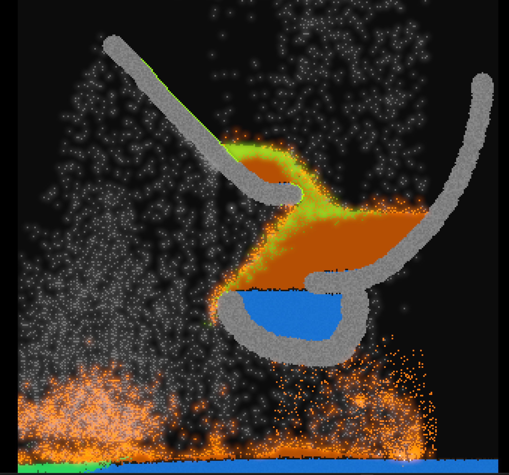

A falling sand simulation written in rust and a small bit of wgsl

## Features
- 25+ materials, inlcuding liquids, powders, solids, and gases
- stains, that can affect material's behaviors or appearance without replacing them (e.g. wet, slimy)
- explosives
- Fire and burning
- bloom and graphics effects
- chunk based performance improvements

## Notes
- I have not optimised this that much, so you probably want to run in release mode